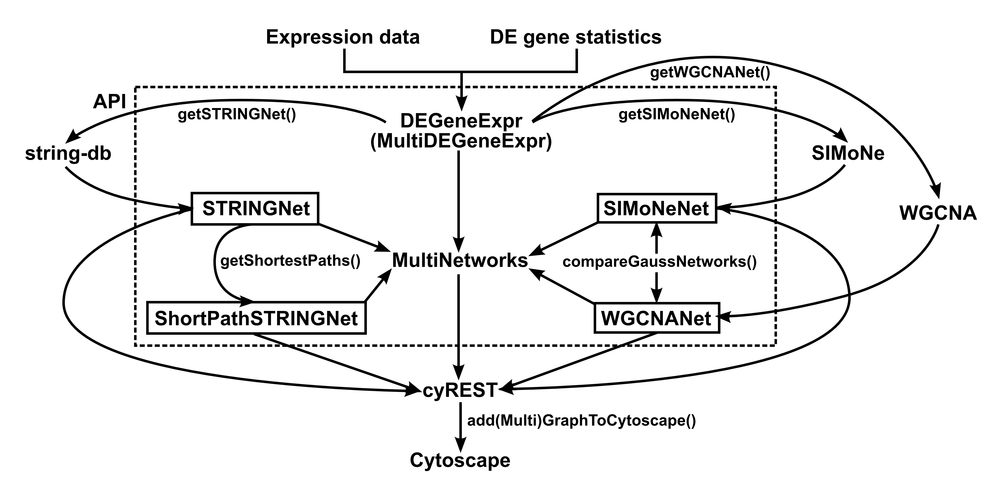
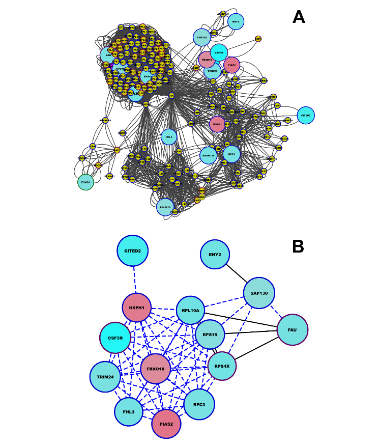
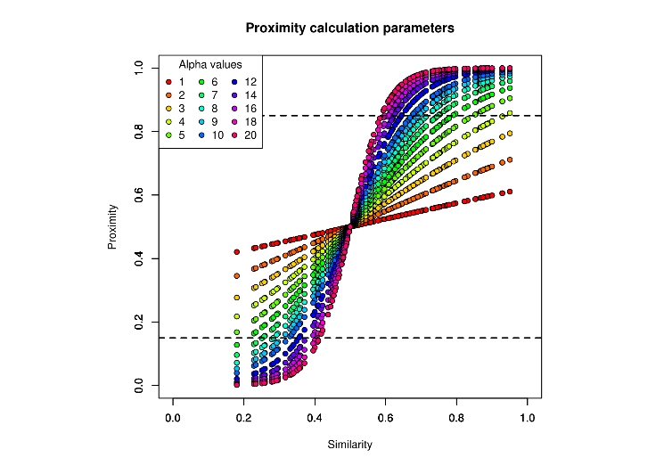
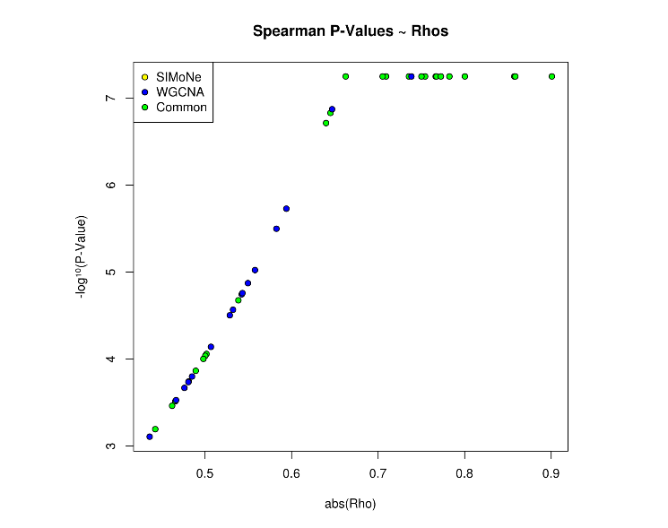
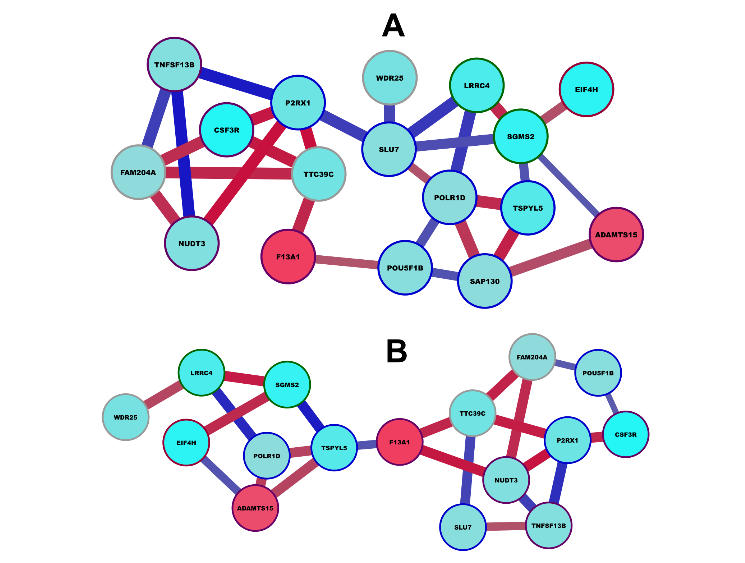

# Introduction
Analysis of genes differentially expressed (DE) depending on a condition has become a standard procedure in current biology. However, identification of biologically relevant DE genes is far from being trivial. Yet efficient prioritization of DE genes is an essential step before undertaking rate-limiting wet lab experiments.[@smyth_linear_2004] In this regard, the network theory appears as a powerful framework. The aim is to connect genes (the nodes) by means of their interactions (the edges).[@dong_understanding_2007] These interactions may be based on prior knowledge, found in databases, or extracted from the experimental dataset, e.g. using coexpression information.[@xue_transcriptome-based_2014; @verfaillie_decoding_2015; @lin_mirna_2015; @cotney_autism-associated_2015] Sophisticated but distinct tools are available to implement either one of these approaches separately. We introduce stringgaussnet, an R package that allows to infer gene networks starting from a list of DE genes by integrating both of these approaches with ease and flexibility.

The main objective of this tool is to be much flexible in function of your needs and to proceed automatically all necessary steps. Semantic networks are constructed by extracting all wished interaction types and possible additional nodes by requesting the STRING Application Programming Interface (API). This tool can also reduce the network by calculating shortest paths between a given number of targeted genes. Gaussian networks are inferred by SIMoNe, with a possible ad-hoc filtering of edges on spearman's rho coefficients. This tool can also use a WGCNA-like approach, a simple correlation calculation with a soft thresholding, to compare results with  SIMoNe. This package integrates R commands allowing to export automatically all created networks in Cytoscape, through the cyREST plugin.[@cline_integration_2007]


> Figure 1: Stringgaussnet operating principle. Starting from expression data and DE gene statistics, it is possible to create all kinds of semantic and gaussian networks, and then to export graphs into Cytoscape. Dashed square represents original methods of stringgaussnet. Main functions are displayed by ending with brackets.

# Hardware and software requirements
This R package is operating system independent. However, some precautions should be taken before using stringgaussnet.

Firstly, one considers that the user (you) already knows how to use basic functions from R and to install necessary packages.

The hardware limitations depends on the network sizes you wish to compute. You mainly have to consider that whatever was your differential analysis tool, stringgaussnet will surely require a lower memory usage, because you will analyze a subset of gene expression data. A computer with at least 2 Go of RAM, a sufficient free disk space (> 1 Go) and a reasonably recent CPU (< 5 years old) is recommended.

Stringgaussnet has only been tested with R version of at least 3.2. We can not guarantee stable computation with previous versions. Otherwise, some R packages must be installed to use all functions from stringgaussnet, which are:

* [AnnotationDbi](http://www.bioconductor.org/packages/release/bioc/html/AnnotationDbi.html)
* [GO.db](http://www.bioconductor.org/packages/release/data/annotation/html/GO.db.html)
* [VennDiagram](http://cran.r-project.org/web/packages/VennDiagram/index.html)
* [simone](http://cran.r-project.org/web/packages/simone/index.html)
* [biomaRt](http://www.bioconductor.org/packages/release/bioc/html/biomaRt.html)
* [limma](http://www.bioconductor.org/packages/release/bioc/html/limma.html)
* [pspearman](http://cran.r-project.org/web/packages/pspearman/index.html)
* [igraph](http://cran.r-project.org/web/packages/igraph/index.html)
* [httr](http://cran.r-project.org/web/packages/httr/index.html)
* [RJSONIO](http://cran.r-project.org/web/packages/RJSONIO/index.html)
* [Rcurl](http://cran.r-project.org/web/packages/RCurl/index.html)
* [org.Hs.eg.db](http://www.bioconductor.org/packages/release/data/annotation/html/org.Hs.eg.db.html)

Regarding packages from CRAN, you must install on his own all necessary secondary packages. Packages from bioconductor are advised to be installed with the function biocLite().

In order to be able to export networks into Cytoscape from R, this software must be independently installed on the same machine (http://www.cytoscape.org/download.php). Please use at least the version 3.2.1 and make sure to have installed java runtime environnment with version > 8 (https://www.java.com/download/). The communication between R and Cytoscape can not be performed without the plugin cyREST (version > 0.9.17, http://apps.cytoscape.org/apps/cyrest). In order to test if the plugin works fine, please turn on Cytoscape and launch the command checkCytoscapeRunning() in R. If this does not work, please try to create a new variable called port.number with a value of 1234. Then restart your computer. If this still does not work, check your Cytoscape, cyREST and java versions.

# Starting with differential analysis results
Stringgaussnet is not a tool of differential analysis for gene expressions. Other powerful tools exist, like limma, and it is considered that you have already identified key DE genes to analyze in a network before using this R package.

The differential analysis results constitute the basis of the package use, and two data frames are  required, which are combined into an object of class DEGeneExpr. Those are expression data and DE genes statistics.

Expression data must count samples as row names and genes as column names. Values are usually normalized for efficient correlation computation.

DE genes statistics can be obtained by analyzing expression data to get genes that are affected by a given phenotype. Those results can be obtained for example by LIMMA. This variable corresponds to a data frame with genes as rows and statistics as columns. The minimum suggested columns are fold changes and p-values for the visualization in Cytoscape, but you are free to set other values as properties for node color and size. Genes in expression data must be exactly the same as those in DE genes statistics.

Those data frames must be firstly combined in an object of class DEGeneExpr, which is then a list with its own print function, giving the number of samples and genes and a preview of the both data frames.

In the example data we provided transcriptomic profiles of monocyte-derived dendritic cells (MD-DCs) from 9 patients affected with ankylosing spondylitis and 10 healthy controls. Transcriptomic data were obtained using microarrays. Gene expression levels in patients and in controls were then compared with LIMMA.[@talpin_monocyte-derived_2014] We limited the number of DE genes to 75.

Let's see how it looks like in the example data inside the package:

```{r eval=FALSE}
library(stringgaussnet)

data(SpADataExpression) # Import example expression data
data(SpADEGenes) # Import example DE genes analysis results
data(SpASamples) # Import example sample description
# We firstly import all example data from stringgaussnet package.
# SpASamples is not compulsory for using stringgaussnet, but is useful for creating a
# factor for subsetting gaussian networks generation.

head(SpASamples,5)
```
```
##   chipnum  status LPStime subject
## 1      21 Patient      H0     I18
## 2      22 Patient      H0     I17
## 3      23 Patient      H0      I4
## 4      24 Patient      H0      I1
## 5      25 Patient      H0      I2
```
```{r eval=FALSE}
# We can see here what sample descriptions look like. LPStime is the LPS stimulation
# duration for MD-DCs.
SpAData<-DEGeneExpr(t(SpADataExpression),SpADEGenes)

print(SpAData,5)
```
```
## Object of class DEGeneExpr (package stringgaussnet) 
## 
## Number of samples: 57 
## Number of genes: 75 
## 
## DataExpression preview:
##       NUDT3    P2RX1    SGMS2    WDR25    F13A1  FAM204A    LRRC4
## 21 10.25609 7.779726 7.478363 7.395941 13.53042 8.865439 6.196102
## 22 10.17532 7.713649 7.426126 7.482414 13.39109 8.743199 6.715109
## 23 10.09892 7.736853 7.514560 7.598745 13.37703 8.716703 7.489576
## 24 10.24614 7.995944 7.962326 7.658044 13.65390 8.732653 6.611568
## 25 10.02167 7.884883 6.473152 7.645395 13.67628 8.581200 6.637558
##        EIF4H   SAP130     SLU7  POU5F1B   POLR1D   TTC39C ADAMTS15
## 21 10.355450 10.17557 8.517671 6.425804 9.553580 7.429002 7.779027
## 22 10.104375 10.18127 7.944881 6.761638 9.350876 7.147367 8.855387
## 23 11.089198 10.28844 7.796919 6.634245 9.377427 7.614758 9.434300
## 24 10.188845 10.28227 8.153847 6.697428 9.390345 7.488865 7.944880
## 25  9.787701 10.14357 7.824845 6.638128 9.036362 7.173620 8.397508
##    TNFSF13B   TSPYL5    CSF3R       FAU     TFAM     FAIM2   CITED2
## 21 10.17795 8.561254 7.383586 10.299998 6.797904  6.753533 11.23097
## 22 10.84027 8.214381 7.135964 10.300351 6.786641 10.433228 11.00969
## 23 10.90312 8.316282 7.008943 10.109672 6.656924  9.121431 10.86765
## 24 10.87046 8.395607 7.803192  9.546860 6.669851 10.279958 11.39621
## 25 10.64746 8.070187 7.843946  9.631554 6.621111  9.579760 11.83044
##    SIGLEC15     MBIP    HAUS1     RFC3     TBCK   TRIM24  ANAPC15     PIGB
## 21 7.730661 8.265060 9.547622 6.717628 9.507269 9.164891 10.42642 8.663999
## 22 8.486743 8.373733 9.286334 6.572705 9.561226 9.012223 10.77170 8.803228
## 23 8.774401 8.302195 9.210819 6.721516 9.318380 9.086190 10.71807 9.102257
## 24 8.724044 8.059957 8.926340 6.859887 9.486730 9.269940 10.73594 8.996247
## 25 8.460145 7.942978 8.907234 6.503483 9.719901 8.715967 10.48000 8.208808
##      DNAJA4    RBBP9 KIAA0907      MUT   FBXO18    USP30      NDP     OLR1
## 21 8.272130 8.143958 9.352399 8.188985 8.265647 8.903849 7.663387 6.220560
## 22 8.370383 7.665083 9.118642 8.275170 8.363612 8.475835 7.667593 6.641498
## 23 8.160428 7.922728 8.891830 8.369798 8.099168 8.736526 6.961104 7.722695
## 24 8.407753 8.101788 9.011711 8.337796 8.353551 8.483161 6.080360 5.939017
## 25 8.047116 7.251024 9.234585 7.995534 7.991599 8.523176 5.715268 6.317065
##        PLP2     MNDA    IFT52    COX20   BAK1P1    CRTAP    RPS15   ALG10B
## 21 11.36747 8.173222 7.287404 7.968966 6.412227 11.28916 10.43043 7.672037
## 22 11.09409 9.675167 6.828304 8.073868 6.570384 11.00393 10.43679 6.686629
## 23 11.20175 8.463822 6.903684 8.310869 6.447920 10.97360 10.63966 7.217247
## 24 11.78391 9.009064 7.119040 8.297897 6.767743 11.39861 10.35509 7.628294
## 25 10.61192 8.824307 6.888093 8.136609 7.137114 11.16194 10.16442 6.972385
##        ENY2    PIAS2    FBXL4    HSPH1    PTPLA    COX7B    EDEM3
## 21 9.043001 9.677796 8.894753 10.96024 7.228479 7.967758 9.340578
## 22 8.295627 9.842157 8.790365 11.17939 7.226040 7.412543 9.267813
## 23 8.808935 9.400758 8.702894 11.01773 6.944539 8.053695 8.921224
## 24 8.651800 9.368522 8.476081 11.29588 6.667556 7.071694 9.336514
## 25 8.298026 9.675684 8.861115 11.21505 7.316875 7.129328 9.400450
##    CTBP1-AS1   HSPA1A     SELL    P4HA1    CKAP2    ELMO1    GTSF1
## 21  8.373863 10.60785 5.866700 9.232794 9.014485 10.88822 5.578275
## 22  8.126615 10.85421 5.726393 9.200150 8.656653 10.68401 5.890657
## 23  8.484404 10.42632 6.278107 9.226551 8.244108 10.68071 5.845840
## 24  8.157645 10.87067 5.989361 9.794671 8.899038 10.76450 5.937787
## 25  8.084694 10.64348 6.251385 9.481582 8.180849 10.71228 4.922962
##       RPS4X     FHL3   SEMA3C    RPL10A  SPATA20   ITPRIP  ZNF804A
## 21 10.20354 9.475687 9.297923  9.780683 8.969004 8.030501 8.230648
## 22 10.22314 9.537080 9.813916  9.642061 9.218515 8.032228 7.943240
## 23 10.44483 9.741039 9.820876 10.185917 9.321994 8.382751 8.378532
## 24 10.22493 9.920751 9.454757  9.691150 9.098727 8.347813 7.909494
## 25 10.72840 8.996963 9.572225  9.261363 8.838107 7.775624 7.602159
##    ANKRD36BP1    BACE2    PORCN    USP40     RND3    ACADM   GPR180
## 21   7.906530 7.728812 8.595057 7.496214 5.611142 9.417765 7.893242
## 22   7.161434 7.261641 8.539727 7.473354 6.057174 9.251663 8.089585
## 23   6.989984 7.505255 8.345492 7.083213 5.914650 9.560359 7.692392
## 24   7.254221 7.185580 8.189664 7.286869 5.472070 9.639629 8.128288
## 25   6.451797 7.973019 8.424378 7.440147 5.745261 8.978150 7.554904
##       TRBC2    PARVG
## 21 7.062023 9.102626
## 22 7.054005 9.251641
## 23 8.127213 9.117042
## 24 6.748430 9.739595
## 25 7.617592 9.866001
## 
## DEGenesResults preview:
##       GeneSymbol       EnsemblId  P.Value Fold.Change      logFC
## NUDT3      NUDT3 ENSG00000112664 4.60e-06        0.60 -0.7369656
## P2RX1      P2RX1 ENSG00000108405 8.45e-06        0.52 -0.9434165
## SGMS2      SGMS2 ENSG00000164023 4.13e-05        0.36 -1.4739312
## WDR25      WDR25 ENSG00000176473 4.45e-05        0.56 -0.8365013
## F13A1      F13A1 ENSG00000124491 6.12e-05        2.63  1.3950628
```
```{r eval=FALSE}
# Here we see that we have 57 samples and 75 DE genes.

# There is a preview of the expression data. Row names correspond to the column chipnum
# in SpAsamples.

# For each gene in row, we have attributes that will be added further as node attributes
# in our networks. Notably, we have here the both gene identifiers HGNC symbols and
# Ensembl IDs, and p-values and fold changes computed by LIMMA.
```

# Semantic network creation with STRING
Stringgaussnet allows to construct a protein-protein interaction (PPI) network using the DE gene names. Then all known PPIs between those genes are explored. To this aim, the package uses the STRING API, which is a query application that works through the construction of a specific URL, which is also called an uniform resource identifier (URI) in this case. The entered gene names can be HGNC symbols or Ensembl IDs, the latter being more specific but less intuitive. Due to STRING server limitations, the number of characters with all gene IDs is limited to 8198 (which represents around 400 genes). The number of additional nodes can be set, but the API gives at least 10 additional genes. Then this package proposes to remove all additional nodes a posteriori by your request. Those added nodes are useful to see indirect interactions between initial nodes. By default, two times the number of initial DE genes identifiers are requested to STRING, in order to get a maximal covering. Different species can be curated, the default being homo sapiens. Species are entered with taxon identifiers. To see correspondence, please have a look here: http://www.uniprot.org/taxonomy

This request through STRING API constructs an object of class STRINGNet, with a network with multiple edges (depending on sources and combined scores). Its print function gives the number of initial and added nodes, and respective numbers of interactions. The summary function displays minimum, maximum, mean and median scores from different sources of interactions. From this object, it is possible to select specific sources of interactions, and to filter on the scores given by STRING. After this step, stringgaussnet calculates a new combined score, based on the calculation given for STRING version 8.1. Computation of more recent methods is not implemented, due to the lack of information concerning their precise algorithm.

Let's see an example in our package:

```{r eval=FALSE}
library(stringgaussnet)
data(SpADataExpression)
data(SpADEGenes)
SpAData<-DEGeneExpr(t(SpADataExpression),SpADEGenes)
SpASTRINGNet<-getSTRINGNet(SpAData)
# Here we get the STRING network with default parameters.
# You can type help(“getSTRINGNet”) for more details.

print(SpASTRINGNet,5)
```
```
## Object of class STRINGNet (package stringgaussnet)
##
## Total number of nodes: 235
## Number of initial nodes: 53
## Number of added nodes: 182
##
## Total number of interactions: 5099
## Number of interactions between initial nodes: 17
## Number of interactions with added nodes: 5082
##
## Edges preview:
##                node1 node2    Interaction Score
## coexpression   RPLP1 RPL36   coexpression 0.931
## experimental   RPLP1 RPL36   experimental 0.929
## knowledge      RPLP1 RPL36      knowledge 0.900
## textmining     RPLP1 RPL36     textmining 0.233
## combined_score RPLP1 RPL36 combined_score 0.999
## 
## DEGenes preview:
##       GeneSymbol       EnsemblId  P.Value Fold.Change      logFC
## NUDT3      NUDT3 ENSG00000112664 4.60e-06        0.60 -0.7369656
## SGMS2      SGMS2 ENSG00000164023 4.13e-05        0.36 -1.4739312
## F13A1      F13A1 ENSG00000124491 6.12e-05        2.63  1.3950628
## LRRC4      LRRC4 ENSG00000128594 8.03e-05        0.42 -1.2515388
## EIF4H      EIF4H ENSG00000106682 1.11e-04        0.34 -1.5563933
```
```{r eval=FALSE}
# We can see that STRING gave a network with 53 from the 75 initial genes
# entered in the API. 183 additional nodes were used to construct the network.

# We can see also that 17 interactions between initial nodes were found, on contrary to
# 5168 including added nodes. Multiple edges are not taken into account, which means
# that the print function displays unique pairs of genes as interactions.

# We have here, for each edge, an interaction source attribute and the corresponding
# score given by STRING. Combined scores are also entered, with the label “combined”.

# As we can see, differential analysis results are used as node attributes.

summary(SpASTRINGNet)
```
```
## All interactions:
##              coexpression cooccurence experimental fusion    knowledge
## Count        4533.0000000 116.0000000 4106.0000000  1.000 3278.0000000
## Min score       0.0640000   0.0057970    0.0430000  0.485    0.3600000
## Max score       0.9750000   0.5250000    0.9990000  0.485    0.9000000
## Mean score      0.7713536   0.2541574    0.7979408  0.485    0.8955888
## Median score    0.9360000   0.2405000    0.9300000  0.485    0.9000000
##              neighborhood  textmining
## Count        1124.0000000 4793.000000
## Min score       0.0650000    0.002376
## Max score       0.6080000    0.999000
## Mean score      0.3569448    0.419683
## Median score    0.4620000    0.401000
## 
## Interactions between initial nodes:
##              coexpression cooccurence experimental knowledge neighborhood
## Count          11.0000000   2.0000000   12.0000000       7.0      4.00000
## Min score       0.1570000   0.1009470    0.1090000       0.9      0.27300
## Max score       0.9750000   0.3750000    0.9990000       0.9      0.46200
## Mean score      0.6133636   0.2379735    0.5840833       0.9      0.41475
## Median score    0.7390000   0.2379735    0.4700000       0.9      0.46200
##              textmining
## Count        15.0000000
## Min score     0.1791130
## Max score     0.7420000
## Mean score    0.3596075
## Median score  0.3150000
## 
## Interactions with added nodes:
##              coexpression cooccurence experimental fusion    knowledge
## Count        4522.0000000 114.0000000 4094.0000000  1.000 3271.0000000
## Min score       0.0640000   0.0057970    0.0430000  0.485    0.3600000
## Max score       0.9750000   0.5250000    0.9990000  0.485    0.9000000
## Mean score      0.7717379   0.2544413    0.7985677  0.485    0.8955793
## Median score    0.9360000   0.2405000    0.9300000  0.485    0.9000000
##              neighborhood   textmining
## Count        1120.0000000 4778.0000000
## Min score       0.0650000    0.0023760
## Max score       0.6080000    0.9990000
## Mean score      0.3567384    0.4198716
## Median score    0.4620000    0.4010000
```
```{r eval=FALSE}
# Here we have score summaries for each interaction source and by making a distinction
# between initial and added nodes.

PPISpASTRINGNet <- selectInteractionTypes(SpASTRINGNet,
  c("coexpression","experimental","knowledge"), 0.9)
# Here we select only interactions of kind “coexpression”, “experimental” and
# “knowledge”, with a score filtering threshold of 0.9.

print(PPISpASTRINGNet,5)
```
```
## Object of class STRINGNet (package stringgaussnet)
## 
## Total number of nodes: 197 
## Number of initial nodes: 25 
## Number of added nodes: 172 
## 
## Total number of interactions: 4027 
## Number of interactions between initial nodes: 7 
## Number of interactions with added nodes: 4020 
## 
## Edges preview:
##               node1 node2  Interaction Score
## coexpression  RPL39 RPL36 coexpression 0.966
## experimental  RPL39 RPL36 experimental 0.986
## knowledge     RPL39 RPL36    knowledge 0.900
## coexpression1 RPL11 RPL13 coexpression 0.975
## experimental1 RPL11 RPL13 experimental 0.999
## 
## DEGenes preview:
##          GeneSymbol       EnsemblId  P.Value Fold.Change      logFC
## LRRC4         LRRC4 ENSG00000128594 8.03e-05        0.42 -1.2515388
## SAP130       SAP130 ENSG00000136715 1.15e-04        0.65 -0.6214884
## SLU7           SLU7 ENSG00000164609 1.50e-04        0.63 -0.6665763
## POLR1D       POLR1D ENSG00000186184 2.24e-04        0.65 -0.6214884
## TNFSF13B   TNFSF13B ENSG00000102524 3.15e-04        0.61 -0.7131189
```
```{r eval=FALSE}
summary(PPISpASTRINGNet)
```
```
## All interactions:
##              coexpression experimental knowledge
## Count        2597.0000000 2352.0000000    3232.0
## Min score       0.9000000    0.9000000       0.9
## Max score       0.9750000    0.9990000       0.9
## Mean score      0.9589634    0.9751926       0.9
## Median score    0.9670000    0.9890000       0.9
## 
## Interactions between initial nodes:
##              coexpression experimental knowledge
## Count              5.0000      4.00000       7.0
## Min score          0.9180      0.93000       0.9
## Max score          0.9750      0.99900       0.9
## Mean score         0.9518      0.98025       0.9
## Median score       0.9580      0.99600       0.9
## 
## Interactions with added nodes:
##              coexpression experimental knowledge
## Count        2592.0000000  2348.000000    3225.0
## Min score       0.9000000     0.900000       0.9
## Max score       0.9750000     0.999000       0.9
## Mean score      0.9589772     0.975184       0.9
## Median score    0.9670000     0.989000       0.9
## Object of class STRINGNet (package stringgaussnet)
##
## Total number of nodes: 235
## Number of initial nodes: 53
## Number of added nodes: 182
##
## Total number of interactions: 5099
## Number of interactions between initial nodes: 17
## Number of interactions with added nodes: 5082
##
## Edges preview:
##                node1 node2    Interaction Score
## coexpression   RPLP1 RPL36   coexpression 0.931
## experimental   RPLP1 RPL36   experimental 0.929
## knowledge      RPLP1 RPL36      knowledge 0.900
## textmining     RPLP1 RPL36     textmining 0.233
## combined_score RPLP1 RPL36 combined_score 0.999
## 
## DEGenes preview:
##       GeneSymbol       EnsemblId  P.Value Fold.Change      logFC
## NUDT3      NUDT3 ENSG00000112664 4.60e-06        0.60 -0.7369656
## SGMS2      SGMS2 ENSG00000164023 4.13e-05        0.36 -1.4739312
## F13A1      F13A1 ENSG00000124491 6.12e-05        2.63  1.3950628
## LRRC4      LRRC4 ENSG00000128594 8.03e-05        0.42 -1.2515388
## EIF4H      EIF4H ENSG00000106682 1.11e-04        0.34 -1.5563933
```

# Short paths from STRINGNet
The generated network can be large and dense. As a STRINGNet object, it can be reduced by computing shortest paths between genes of a user's list ([Figure 2](#figure2)). To this aim, combined scores S are converted to distances D for each node pair i with Di=max(Si)+1-Si, where max(Si) is the maximum of S over all interactions. The distance represents a value comprised between 1 and 2, and higher is the score, lower is the distance. The shortest paths between each pair of given nodes are computed with the Dijkstra's algorithm, provided in the R package igraph. This method creates an object of class ShortPathSTRINGNet, with unique edges giving distances and intermediates as attributes. The print and summary functions are quite similar to STRINGNet, but they focus more on the distance attributes than on the scores. It is then possible to filter on the distance, if you wish to look only for closest interactions.

<a name="figure2"></a>

> Figure 2: From STRINGnet (A) to ShortPathSTRINGNet (B) object. We can see that we considerably reduce displayed information noise for large networks. Dashed blue lines in B represent indirect interactions.

Let's take a look in the example:

```{r eval=FALSE}
library(stringgaussnet)
data(SpADataExpression)
data(SpADEGenes)
SpAData<-DEGeneExpr(t(SpADataExpression),SpADEGenes)
SpASTRINGNet<-getSTRINGNet(SpAData)
PPISpASTRINGNet <- selectInteractionTypes(SpASTRINGNet,
  c("coexpression","experimental","knowledge"), 0.9)
shortPathSpANet<-getShortestPaths(PPISpASTRINGNet)
# Here we get the short paths STRING network with default parameters.
# You can type help(“getShortestPaths”) for more details.
shortPathSpANet<-FilterEdges(shortPathSpANet,5)
# Here we can filter on the distance between two nodes.
print(shortPathSpANet,5)
```
```
## Object of class ShortPathSTRINGNet (package stringgaussnet)
## 
## Total number of nodes: 18 
## Number of initial nodes: 18 
## Number of added nodes: 0 
## Number of intermediate nodes: 20 
## Total number of interactions: 151 
## Number of interactions between initial nodes: 151 
## Number of interactions with added nodes: 0 
## 
## Edges preview:
##    node1  node2     Interaction Distance NIntermediates    Intermediates
## 1 SAP130 POLR1D shortestpathway 3.109328              2     MAGOH,POLR2E
## 2 SAP130  CSF3R shortestpathway 3.120991              2        MAGOH,UBC
## 3 SAP130    FAU shortestpathway 2.103994              1            MAGOH
## 4 SAP130 CITED2 shortestpathway 4.139095              3 DNMT1,PCNA,EP300
## 5 SAP130   RFC3 shortestpathway 3.101098              2       DNMT1,PCNA
## 
## DEGenes preview:
##        GeneSymbol       EnsemblId  P.Value Fold.Change      logFC
## SAP130     SAP130 ENSG00000136715 0.000115        0.65 -0.6214884
## POLR1D     POLR1D ENSG00000186184 0.000224        0.65 -0.6214884
## CSF3R       CSF3R ENSG00000119535 0.000564        0.32 -1.6438562
## FAU           FAU ENSG00000149806 0.000603        0.56 -0.8365013
## CITED2     CITED2 ENSG00000164442 0.000729        0.40 -1.3219281
```
```{r eval=FALSE}
# Here we don't have any added node, because we summarized the network only between
# initial nodes. We can see that 20 genes were used as intermediates.

# We have unique edges with distance, number of intermediates and intermediate names
# as attributes.
```

# SIMoNe network inference
Another use of this package is to infer a gaussian network from expression data. We implemented the use of the R package simone, in order to strongly reduce noise from indirect interactions without supervision.[@chiquet_simone:_2009] All options from SIMoNe are changeable in stringgaussnet, and default values are given for users who want to discover this tool. The default method to select the inferred model by SIMoNe in our package helps to make a choice with a better compromise. The number of edges is selected by computing the mean between those with maximal AIC and BIC scores. You can choose otherwise a fixed edges number, or to base only on AIC or BIC score. Without choice from you, the algorithm computes a network with or without clustering constraints, and selects only common edges between the both models. A function is provided to help in selecting the best model inferred by SIMoNe with a series of graphs, which are already implemented in the simone package. Notably, you can see all BIC and AIC scores as a function of the penalty level given in the graphical LASSO method. In addition to the theta score given by SIMoNe, stringgaussnet computes spearman's test for each inferred edge, with an AS89 approximation of null distribution.

This inference creates an object of class SIMoNeNet, with a network of unique edges including theta, spearman's rho and p-value as attributes. The associated print function displays the number of nodes and edges, with a preview of node and edge attributes. The summary function summarizes theta scores, spearman's rho and their absolute values, and spearman's test p-values. This is possible to filter on edge attributes, notably on spearman's rho. This is useful for large networks, considering that SIMoNe can infer interactions without strong correlations. A function is provided to plot a network preview, based on the original simone package.

Let's see how it works with the example data:

```{r}
library(stringgaussnet)
data(SpADataExpression)
data(SpADEGenes)
SpAData<-DEGeneExpr(t(SpADataExpression),SpADEGenes)
NodesForSIMoNe<-rownames(SpADEGenes)[1:17]
GaussianSpAData<-DEGeneExpr(
  t(SpADataExpression[NodesForSIMoNe,]),
  SpADEGenes[NodesForSIMoNe,])
# We select a reasonable number of genes for SIMoNe network inference.
# We advice to take a number of genes being inferior to the sample size.
#pickSIMoNeParam(GaussianSpAData)
# We use a series of plot provided with the simone package to see which penalty level
# we can use for the graphical LASSO regression.
GlobalSIMoNeNet<-getSIMoNeNet(GaussianSpAData)
# Here we get the SIMoNe network with default parameters.
# You can type help(“getSIMoNeNet”) for more details.
GlobalSIMoNeNet<-FilterEdges(GlobalSIMoNeNet,0.4)
# Here we can filter on the absolute values of rho being superior to 0.4.
print(GlobalSIMoNeNet,5)
# We have unique edges with Theta scores, and spearman's rhos and p-values.
plot(GlobalSIMoNeNet)
# Here we have the network displayed with the plot function provided with the
# simone package.
```

# WGCNA network inference and comparison with SIMoNe
SIMoNe is a powerful statistical approach to infer non-supervised gaussian networks. However, the algorithm principle is not intuitive for any beginner in the graph theory domain and statistical inference. This is why we propose to compare with a more trivial approach: WGCNA. Stringgaussnet allows to compute spearman's test between all pairs of genes, and respective rhos are converted to similarity scores $\sigma$ with $\sigma=(1+rho)/2$, in order to keep the correlation signs. Then those scores are converted to proximity scores A, with $A=1/(1+exp(-\alpha*(\sigma-0,5)))$. $\alpha$ is the soft power threshold, and is by default 8 in the package. A function is provided to help in choosing this parameter, by giving a series of plots representing relations between A and rho ([Figure 3](#figure3)). Then a filtering step is proceeded with  a threshold t, A being superior to t or inferior to 1-t. By default, t is 0,85, as suggested by the WGCNA tutorial. Dissimilarities and modules computations are not implemented, because the main purpose is to compare with SIMoNe and to empower its use.
<a name="figure3"></a>

> Figure 3: A plot to help in choosing the soft thresholding parameter. Different alpha values are used to visualize different possibilities.

The obtained network is saved in a WGCNANet class object, with print and summary functions much similar to SIMoNeNet. This is also possible to draw the inferred network in the same way as for SIMoNeNet. A function is provided to compare inferred networks from both SIMoNe and WGCNA, with venn diagram displaying respective connectivities, and a series of plots showing correlations of picked interactions ([Figure 4](#figure4)). Please see `help(“compareGaussNetworks”)` for more informations.
<a name="figure4"></a>

> Figure 4: Comparison plot of spearman's rho and p-value between SIMoNe WGCNA infered networks. We can notice that SIMoNe removes a lot of interactions thanks to the partial correlation computation.

Let's have a look in the example:

```{r}
library(stringgaussnet)
data(SpADataExpression)
data(SpADEGenes)
SpAData<-DEGeneExpr(t(SpADataExpression),SpADEGenes)
NodesForSIMoNe<-rownames(SpADEGenes)[1:17]
GaussianSpAData<-DEGeneExpr(
  t(SpADataExpression[NodesForSIMoNe,]),
  SpADEGenes[NodesForSIMoNe,])
#pickWGCNAParam(GaussianSpAData)
# Here we use a list of plots to help in choosing the right parameter for
# WGCNA computing. You can see help(“pickWGCNAParam”) for more details.
GlobalWGCNANet<-getWGCNANet(GaussianSpAData)
# Here we get the WGCNA network with default parameters.
# You can type help(“getWGCNANet”) for more details.
print(GlobalWGCNANet,5)
# We have adjacency scores, and spearman's rhos and p-values for each edge.
plot(GlobalWGCNANet)
# Here we have the network displayed with the plot function provided in the
# simone package.
```

# Adding annotations to genes
For each of those different described kinds of networks, this is possible to add gene annotations as node attributes. This option is usable at the same step as for network generation. This enrichment adds two kinds of informations. First, stringgaussnet uses the R package biomaRt to get mainly genomic localization and gene description. Secondly, it adds cellular component terms with the package GO.db. Because several components can be linked to one gene, a prioritization is performed to rank genes products localizations from nuclear, the most important, and then extracellular, plasma membrane and cytoplasm. Indeed, we suppose that cytoplasmic localization is the lowest important information, because the most part of genes go through this component to arrive in others. To use this feature, you can use the parameter `AddAnnotations=TRUE` for each network creation function.

Let's see an example for SIMoNeNet:

```{r eval=FALSE}
library(stringgaussnet)
data(SpADataExpression)
data(SpADEGenes)
SpAData<-DEGeneExpr(t(SpADataExpression),SpADEGenes)
NodesForSIMoNe<-rownames(SpADEGenes)[1:17]
GaussianSpAData<-DEGeneExpr(
  t(SpADataExpression[NodesForSIMoNe,]),
  SpADEGenes[NodesForSIMoNe,])
GlobalSIMoNeNet<-getSIMoNeNet(GaussianSpAData,
  AddAnnotations=TRUE)
# Here we use the parameter “AddAnnotations=TRUE” to add annotations to genes from
# the network.
print(GlobalSIMoNeNet,5)
```
```
## Object of class SIMoNeNet (package stringgaussnet)
## 
## Number of nodes: 17 
## Number of interactions: 36 
## 
## Edges preview:
##   node1   node2     Interaction       Theta       Rho    P.Value
## 1 NUDT3   P2RX1 SIMoNeInference -0.38204142 0.9008297 0.00000000
## 2 NUDT3   WDR25 SIMoNeInference -0.04485639 0.3279103 0.01311308
## 3 NUDT3   F13A1 SIMoNeInference -0.08337518 0.7824086 0.00000000
## 4 P2RX1   F13A1 SIMoNeInference -0.04243323 0.7665932 0.00000000
## 5 NUDT3 FAM204A SIMoNeInference -0.14221514 0.7543550 0.00000000
## 
## DEGenes preview:
##       GeneSymbol       EnsemblId  P.Value Fold.Change      logFC
## NUDT3      NUDT3 ENSG00000112664 4.60e-06        0.60 -0.7369656
## P2RX1      P2RX1 ENSG00000108405 8.45e-06        0.52 -0.9434165
## SGMS2      SGMS2 ENSG00000164023 4.13e-05        0.36 -1.4739312
## WDR25      WDR25 ENSG00000176473 4.45e-05        0.56 -0.8365013
## F13A1      F13A1 ENSG00000124491 6.12e-05        2.63  1.3950628
## 
## Annotations preview:
##          ensembl_gene_id  localization hgnc_symbol chromosome_name   band
## ADAMTS15 ENSG00000166106 extracellular    ADAMTS15              11  q24.3
## CSF3R    ENSG00000119535 extracellular       CSF3R               1  p34.3
## EIF4H    ENSG00000106682     cytoplasm       EIF4H               7 q11.23
## F13A1    ENSG00000124491 extracellular       F13A1               6  p25.1
## FAM204A  ENSG00000165669          <NA>     FAM204A              10 q26.11
##          strand start_position end_position
## ADAMTS15      1      130448974    130476641
## CSF3R        -1       36466043     36483278
## EIF4H         1       74174245     74197101
## F13A1        -1        6144085      6321013
## FAM204A      -1      118297930    118342328
##                                                                                             description
## ADAMTS15 ADAM metallopeptidase with thrombospondin type 1 motif, 15 [Source:HGNC Symbol;Acc:HGNC:16305]
## CSF3R             colony stimulating factor 3 receptor (granulocyte) [Source:HGNC Symbol;Acc:HGNC:2439]
## EIF4H                   eukaryotic translation initiation factor 4H [Source:HGNC Symbol;Acc:HGNC:12741]
## F13A1                        coagulation factor XIII, A1 polypeptide [Source:HGNC Symbol;Acc:HGNC:3531]
## FAM204A               family with sequence similarity 204, member A [Source:HGNC Symbol;Acc:HGNC:25794]
```
```{r eval=FALSE}
# We can see that we have gene annotations added by biomaRt and gene product
# localizations provided by Gene Ontology.
```

# Multiple gaussian networks inference as a function of a factor
An overlay of functions allows you to create multiple networks in only one step, with all options configurable in the same method. One can create multiple Gaussian networks from the same DEGeneExpr object, depending on a grouping factor and for a given list of genes. The package then allows to compare networks inferred for multiple levels of the factor, and for the same DE genes list ([Figure 5](#figure5)).
<a name="figure5"></a>

> Figure 5: Example of infered SIMoNe networks between two groups (A and B) of a given factor (disease status in our example). Stringgaussnet allows to generate automatically the both networks in one step.

Here is an example for SIMoNeNet and patient status:

```{r}
library(stringgaussnet)
data(SpADataExpression)
data(SpADEGenes)
data(SpASamples)
SpAData<-DEGeneExpr(t(SpADataExpression),SpADEGenes)
StatusFactor<-SpASamples$status
names(StatusFactor)<-SpASamples$chipnum
# We create a factor vector based on the status.
NodesForSIMoNe<-rownames(SpADEGenes)[1:17]
GaussianSpAData<-DEGeneExpr(
  t(SpADataExpression[NodesForSIMoNe,]),
  SpADEGenes[NodesForSIMoNe,])
StatusFactorSIMoNeNet<-FactorNetworks(GaussianSpAData,
  StatusFactor,"SIMoNe")
# We infer different SIMoNe networks on different groups of samples
# (patients and controls).
StatusFactorSIMoNeNet<-FilterEdges(StatusFactorSIMoNeNet,0.4)
# We can filter on edges, like for SIMoNeNet.
print(StatusFactorSIMoNeNet)
# We can see that we have a preview of inferred networks for each level.
par(mfrow=c(2,1))
plot(StatusFactorSIMoNeNet,interactiveMode=F)
# Here we can display networks inferred in patients and controls specifically, like in
# the Figure 5, with the provided function in the simone package.

#compareFactorNetworks(StatusFactorSIMoNeNet)
# Here we can have a series of plots to compare results of inferred networks for
# each level. You can see help (“compareFactorNetworks”) for more details.

#StatusFactorSIMoNeNet<-FactorNetworks(GaussianSpAData,
#  StatusFactor,"SIMoNe",list(AddAnnotations=TRUE))
# This is how you should do if you wanted to add gene annotations.
```

# Multiple networks generation from a list of differential analysis results
One can create an object of class MultiDEGeneExpr, a list of DEGeneExpr objects. Then, both kinds of networks, semantic or Gaussian, can be generated for each data set and stored in a MultiNetworks object.. This wrapper is useful to explore all possible interactions between a set of DE genes lists. All options for each network generation are accessible through an unique function.

Let's have a look in an example:

```{r eval=FALSE}
library(stringgaussnet)
data(SpADataExpression)
data(SpADEGenes)
data(SpASamples)
SpAData<-DEGeneExpr(t(SpADataExpression),SpADEGenes)
StatusFactor<-SpASamples$status
names(StatusFactor)<-SpASamples$chipnum
NodesForSIMoNe<-rownames(SpADEGenes)[1:17]
GaussianSpAData<-DEGeneExpr(
  t(SpADataExpression[NodesForSIMoNe,]),
  SpADEGenes[NodesForSIMoNe,])
MultiSpAData<-MultiDEGeneExpr(GaussianSpAData,
  DEGeneExpr(t(SpADataExpression[18:34,]),
  SpADEGenes[18:34,]),
  DEGeneExpr(t(SpADataExpression[35:51,]),
  SpADEGenes[35:51,]))
# We create multiple lists of DE genes results, and then a list of DEGeneExpr objects,
# by subsetting the original data.
print(MultiSpAData)
```
```
## Object of class MultiDEGeneExpr (package stringgaussnet)
## 
## 3 objects of class DEGeneExpr (List1, List2, List3)
## 
## List1:
## Object of class DEGeneExpr (package stringgaussnet) 
## 
## Number of samples: 57 
## Number of genes: 17 
## 
## DataExpression preview:
##       NUDT3    P2RX1    SGMS2    WDR25    F13A1  FAM204A    LRRC4    EIF4H
## 21 10.25609 7.779726 7.478363 7.395941 13.53042 8.865439 6.196102 10.35545
## 22 10.17532 7.713649 7.426126 7.482414 13.39109 8.743199 6.715109 10.10438
##      SAP130     SLU7  POU5F1B   POLR1D   TTC39C ADAMTS15 TNFSF13B   TSPYL5
## 21 10.17557 8.517671 6.425804 9.553580 7.429002 7.779027 10.17795 8.561254
## 22 10.18127 7.944881 6.761638 9.350876 7.147367 8.855387 10.84027 8.214381
##       CSF3R
## 21 7.383586
## 22 7.135964
## 
## DEGenesResults preview:
##       GeneSymbol       EnsemblId  P.Value Fold.Change      logFC
## NUDT3      NUDT3 ENSG00000112664 4.60e-06        0.60 -0.7369656
## P2RX1      P2RX1 ENSG00000108405 8.45e-06        0.52 -0.9434165
## 
## List2:
## Object of class DEGeneExpr (package stringgaussnet) 
## 
## Number of samples: 57 
## Number of genes: 17 
## 
## DataExpression preview:
##         FAU     TFAM     FAIM2   CITED2 SIGLEC15     MBIP    HAUS1
## 21 10.30000 6.797904  6.753533 11.23097 7.730661 8.265060 9.547622
## 22 10.30035 6.786641 10.433228 11.00969 8.486743 8.373733 9.286334
##        RFC3     TBCK   TRIM24  ANAPC15     PIGB   DNAJA4    RBBP9 KIAA0907
## 21 6.717628 9.507269 9.164891 10.42642 8.663999 8.272130 8.143958 9.352399
## 22 6.572705 9.561226 9.012223 10.77170 8.803228 8.370383 7.665083 9.118642
##         MUT   FBXO18
## 21 8.188985 8.265647
## 22 8.275170 8.363612
## 
## DEGenesResults preview:
##      GeneSymbol       EnsemblId  P.Value Fold.Change      logFC
## FAU         FAU ENSG00000149806 0.000603        0.56 -0.8365013
## TFAM       TFAM ENSG00000108064 0.000640        0.63 -0.6665763
## 
## List3:
## Object of class DEGeneExpr (package stringgaussnet) 
## 
## Number of samples: 57 
## Number of genes: 17 
## 
## DataExpression preview:
##       USP30      NDP     OLR1     PLP2     MNDA    IFT52    COX20   BAK1P1
## 21 8.903849 7.663387 6.220560 11.36747 8.173222 7.287404 7.968966 6.412227
## 22 8.475835 7.667593 6.641498 11.09409 9.675167 6.828304 8.073868 6.570384
##       CRTAP    RPS15   ALG10B     ENY2    PIAS2    FBXL4    HSPH1    PTPLA
## 21 11.28916 10.43043 7.672037 9.043001 9.677796 8.894753 10.96024 7.228479
## 22 11.00393 10.43679 6.686629 8.295627 9.842157 8.790365 11.17939 7.226040
##       COX7B
## 21 7.967758
## 22 7.412543
## 
## DEGenesResults preview:
##       GeneSymbol       EnsemblId P.Value Fold.Change      logFC
## USP30      USP30 ENSG00000135093 0.00320        0.60 -0.7369656
## NDP          NDP ENSG00000124479 0.00321        0.13 -2.9434165
```
```{r eval=FALSE}
# We have, by the specific print function, a preview of each DEGeneExpr object
# in the list.
MultiSpANetworks<-MultiNetworks(MultiSpAData,
  SelectInteractionsSTRING=c("coexpression",
  "experimental","knowledge"),STRINGThreshold=0.9,
  FilterSIMoNeOptions=list(Threshold=0.4),
  Factors=StatusFactor)
# We create an object of class MultiNetworks, which allows to generate all kinds of
# networks in multiple lists of DEGeneExpr objects in one line.
print(MultiSpANetworks)
```
```
## Object of class MultiNetworks (package stringgaussnet)
## 
## 3 object(s) of class DEGeneExpr used (List1, List2, List3)
## 
## 3 method(s) of network creation used (STRING, SIMoNe, WGCNA)
## 
## A factor with 2 levels has been entered by the user (Control, Patient)
```
```{r eval=FALSE}
# We simply have a summary of the used method to generate the MultiNetworks object.

#MultiSpANetworks<-MultiNetworks(MultiSpAData,
#  SelectInteractionsSTRING=c("coexpression",
#  "experimental","knowledge"),STRINGThreshold=0.9,
#  FilterSIMoNeOptions=list(Threshold=0.4),
#  Factors=StatusFactor,
#  STRINGOptions=list(AddAnnotations=TRUE),
#  SIMoNeOptions=list(AddAnnotations=TRUE),
#  WGCNAOptions=list(AddAnnotations=TRUE))
# This is how you should do if you wanted to add gene annotations for all network generations.
```

# Network exportation into files and Cytoscape
An important feature of stringgaussnet is to allow to visualize and manipulate all generated networks only in few steps, without any knowledge in network files manipulations and package object structures. Firstly, a generic export function is available to save all generated networks in standard edge and node attributes format.

Let's see here an example for SIMoNeNet:
```{r eval=FALSE}
library(stringgaussnet)
data(SpADataExpression)
data(SpADEGenes)
SpAData<-DEGeneExpr(t(SpADataExpression),SpADEGenes)
NodesForSIMoNe<-rownames(SpADEGenes)[1:17]
GaussianSpAData<-DEGeneExpr(
  t(SpADataExpression[NodesForSIMoNe,]),
  SpADEGenes[NodesForSIMoNe,])
GlobalSIMoNeNet<-getSIMoNeNet(GaussianSpAData,
  AddAnnotations=TRUE)
GlobalSIMoNeNet<-FilterEdges(GlobalSIMoNeNet,0.4)
export(GlobalSIMoNeNet,YourDirPath)
# Replace YourDirPath by the directory where will be saved edge and node attributes.
# If the directory exists, this will not be overwritten,
# excepted if you use the parameter “overwrite=TRUE”.
```

But the most interesting part is to be able to import automatically all generated networks from R objects to Cytoscape, without any requirement of secondary language. Cytoscape is a powerful software to compute biological networks. Automatic importation through stringgaussnet uses the plugin cyREST, which works like a local API. Thus, for this feature, Cytoscape must be running and this plugin installed. At least java version 8 must be installed on the computer, which is the case for the most windows running computers. Moreover, this importation is not operating system dependent, such as the R programming language. For more information about software requirements, please see [Hardware and software requirements](#hardware-and-software-requirements).

Cytoscape uses styles to display imported networks. Our package generates predefined styles, which can be then easily modified in Cytoscape. But you can choose to handle custom styles available in the running Cytoscape session. Node sizes and colors are dependent by default on fold change and p-value from DE genes analysis, but you can choose what attributes can be at the basis of those properties. Edge views depend on attributes from each kind of generated network, e.g. spearman's rho for gaussian networks. Indirect interactions from ShortPathSTRINGNet are displayed with dashed blue lines. The layout can also be set, which is by default force-directed.

Let's see an example for MultiNetworks:
```{r eval=FALSE}
library(stringgaussnet)
data(SpADataExpression)
data(SpADEGenes)
data(SpASamples)
SpAData<-DEGeneExpr(t(SpADataExpression),SpADEGenes)
StatusFactor<-SpASamples$status
names(StatusFactor)<-SpASamples$chipnum
NodesForSIMoNe<-rownames(SpADEGenes)[1:17]
GaussianSpAData<-DEGeneExpr(
  t(SpADataExpression[NodesForSIMoNe,]),
  SpADEGenes[NodesForSIMoNe,])
MultiSpAData<-MultiDEGeneExpr(GaussianSpAData,
  DEGeneExpr(t(SpADataExpression[18:34,]),
  SpADEGenes[18:34,]),
  DEGeneExpr(t(SpADataExpression[35:51,]),
  SpADEGenes[35:51,]))
MultiSpANetworks<-MultiNetworks(MultiSpAData,
  SelectInteractionsSTRING=c("coexpression",
  "experimental","knowledge"),STRINGThreshold=0.9,
  FilterSIMoNeOptions=list(Threshold=0.4),
  Factors=StatusFactor,
  STRINGOptions=list(AddAnnotations=TRUE),
  SIMoNeOptions=list(AddAnnotations=TRUE),
  WGCNAOptions=list(AddAnnotations=TRUE))
resetCytoscapeSession()
# We reset and create an empty session in Cytoscape.
# Please be sure that Cytoscape is running with the cyREST plugin installed.
addMultiGraphToCytoscape(MultiSpANetworks,
  points.size.map="P.Value",points.fill.map="logFC")
# We add automatically all generated networks in the Cytoscape session,
# with predefined styles.
saveCytoscapeSession(YourFilePath)
# We can save the current Cytoscape session in a .cys file.
# Replace YourFilePath with the path where you would like to save.
# The .cys extension is automatically added if necessary.
```

# References
